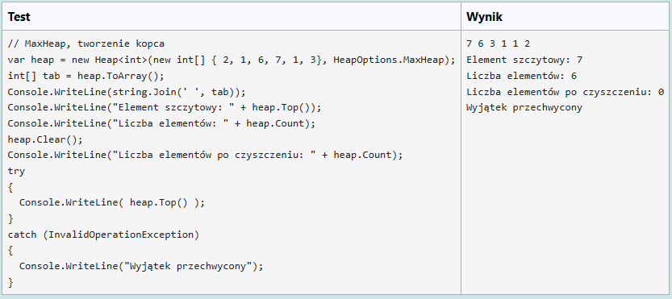

# Implementacja struktury danych `Heap<T>`

Zaimplementuj strukturę danych `Heap<T>` uniwersalną, realizującą *Max-Heap* oraz *Min-Heap* w zależności od parametru przekazanego w konstruktorze.
Dany jest `enum` o deklaracji:

``` C#
public enum HeapOptions { MaxHeap = -1, MinHeap = 1 }
```

Powyższego kodu nie kopiuj, jest dołączony do części testującej zadania.

Rozważ poniższą fragmentaryczną realizację klasy `Heap<T>`:

``` C#
public class Heap<T> where T : IComparable<T>
{
    private List<T> list;
    public HeapOptions Option { get; }

   // tworzy pusty kopiec dla określonego porządku
    public Heap(HeapOptions option = HeapOptions.MinHeap)
    {
        this.Option = option;
        list = new List<T>();
    }
  // ... uzupełnij kod
}
```

 - Powyższa implementacja opiera się na liście, przechowującej sekwencję elementów kopca. Idea opisana jest na [Wikipedii](https://en.wikipedia.org/wiki/Heap_(data_structure)).

 - Elementy typu T są porównywalne (gwarantuje to klauzula `where T : IComparable<T>`).

 - Przekazana konstruktorowi opcja tworzenia kopca (*MinHeap* lub *MaxHeap*) określa jego wewnętrzne działanie.

Twoim zadaniem jest dokończyć implementację struktury danych *Heap*, uzupełniając ją o:

 - konstruktor o sygnaturze:

   ``` C#
   public Heap(IEnumerable<T> collection, HeapOptions option = HeapOptions.MinHeap)
   ```

   tworzący kopiec na podstawie kolekcji przekazanej jako argument, o ustalonym wariancie (domyślnie *Min-Heap*).

 - właściwość `public int Count { get; }` zwracającą liczbę elementów kopca

 - metodę `public void Insert(T x)` wstawiającą element do kopca

 - metodę `public T Delete()` usuwającą element szczytowy z kopca ( i zwracającą ten usuwany element)

 - metodę `public T Top()` zwracającą element szczytowy kopca (bez usuwania go)

 - metodę `public void Clear()` usuwającą z kopca wszystkie elementy

 - metodę `public T[] ToArray()` zwracającą tablicę elementów kopca w kolejności zapamiętania ich w liście

> UWAGA: próba odczytu elementu lub usunięcia elementu topowego z kopca pustego powoduje zgłoszenie wyjątku `InvalidOperationException`.

Zaimplementuj w klasie `Heap<T>` interfejs `IEnumerable<T>` umożliwiający odczytywanie elementów kopca kolejno wierszami, za pomocą pętli foreach.

---

W oknie formularza zgłoszenia wklejasz kod klasy `Heap<T>`. Twój kod nie jest umieszczony w żadnej przestrzeni nazw. Twój kod zapisany zostanie do pliku `Heap.cs` a następnie skompilowany z kodem klasy `Program` zawierającym w metodzie `Main()` wstrzykiwany kod testów.

Na przykład:

