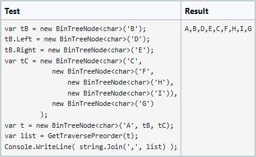

Dana jest klasa `BinTreeNode<T>` opisująca węzeł drzewa binarnego:

``` C#
public class BinTreeNode<T>
{
    public T Value { get; set; }
    public BinTreeNode<T> Left { get; set; }
    public BinTreeNode<T> Right { get; set; }

    public BinTreeNode(T value, BinTreeNode<T> left = null, BinTreeNode<T> right = null)
    {
        Value = value;
        Left = left;
        Right = right;
    }
}
```

Dodatkowo, dana jest metoda wypisująca na konsoli, dla wskazanego węzła `p` będącego korzeniem drzewa, węzły tego drzewa, stosując sugestywne wcięcia.

``` C#
public static void Print<T>(BinTreeNode<T> p, int level = 0)
{
    if (p == null) return;
    Print(p.Right, level + 1);
    Console.WriteLine("".PadLeft(level, '.') + p.Value);
    Print(p.Left, level + 1);
}
```

oraz rekurencyjna metoda przechodzenia po drzewie w porządku *PreOrder* oraz wykonania działania na odwiedzanym węźle opisanym procedurą `action`:

``` C#
public static void TraversePreOrder<T>(BinTreeNode<T> tree, Action<T> action)
{
    if (tree == null) return;
    action(tree.Value);
    TraversePreOrder(tree.Left, action);
    TraversePreOrder(tree.Right, action);
}
```

Napisz metodę o sygnaturze:

``` C#
public static List<T> GetTraversePreorder<T>(BinTreeNode<T> tree)
```

która zwraca listę wartości węzłów drzewa w porządku *PreOrder*. Wykorzystaj metodę `TraversePreOrder<T>()`.

>⚠️ UWAGA: Nie wprowadzasz klasy BinTreeNode<T> - ona jest już dostarczona. Implementujesz **tylko** kod zadanej metody.

**For example:**

