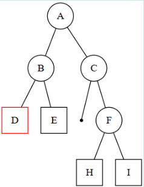
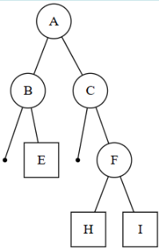
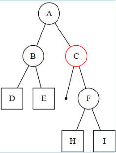
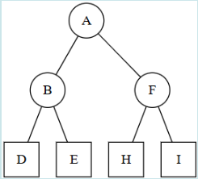
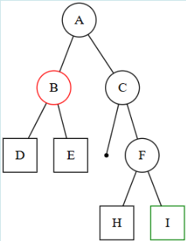
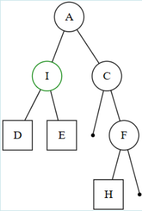
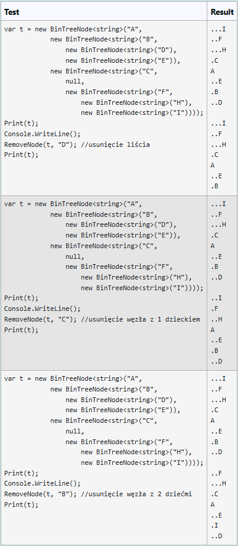

Dana jest klasa `BinTreeNode<T>` opisująca węzeł drzewa binarnego:

``` C#
public class BinTreeNode<T>
{
    public T Value { get; set; }
    public BinTreeNode<T> Left { get; set; }
    public BinTreeNode<T> Right { get; set; }

    public BinTreeNode(T value, BinTreeNode<T> left = null, BinTreeNode<T> right = null)
    {
        Value = value;
        Left = left;
        Right = right;
    }
}
```


Dodatkowo, dana jest metoda wypisująca na konsoli, dla wskazanego węzła `p` będącego korzeniem drzewa, węzły tego drzewa, stosując sugestywne wcięcia.


``` C#
public static void Print<T>(BinTreeNode<T> p, int level = 0)
{
    if (p == null) return;
    Print(p.Right, level + 1);
    Console.WriteLine("".PadLeft(level, '.') + p.Value);
    Print(p.Left, level + 1);
}
```


Napisz funkcję (iterator) o sygnaturze:

``` C#
public static void RemoveNode<T>(BinTreeNode<T> root, T value)
```


która usuwa z drzewa binarnego węzeł o wartości `value`. W drzewie wskazywanym przez `root` **wartości są unikalne.**

Przy usuwaniu węzła przyjmij następującą strategię:
  1. Jeśli węzeł o wartości value nie istnieje w drzewie, to nic nie rób.
  2. Jeśli węzeł o wartości value jest liściem, to usuń go.
  3. Jeśli węzeł o wartości value ma jedno dziecko, to zastąp go przez to dziecko.
  4. Jeśli węzeł o wartości value ma dwoje dzieci, to zastąp go przez najgłębiej i najbardziej na prawo położonego liścia drzewa.


# Przykład 1 - usunięcie liścia:
Dla drzewa: 



po usunięciu węzła `D` powinno powstać drzewo:




# Przykład 2 - usunięcie węzła z jednym dzieckiem:
Dla drzewa:



po usunięciu węzła `C` powinno powstać drzewo:




# Przykład 3 - usunięcie węzła z dwójką dzieci:
Dla drzewa:



po usunięciu węzła `B` powinno powstać drzewo:




**For example:**

