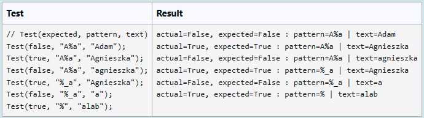

W języku SQL operator `LIKE` sprawdza dopasowanie łańcucha znaków do wzorca. Wzorzec składa się ze znaków "zwykłych" oraz dwóch znaków specjalnych, wieloznacznych (ang. wildcards) o następujących znaczeniach:

- `%` - dowolna liczba dowolnych znaków (zero, jeden lub więcej)
- `_` - dokładnie jeden dowolny znak "zwykły"
Operator ten wykorzystywany jest do budowania wyrażeń logicznych, między innymi umieszczanych w klauzuli WHERE, w celu filtrowania wyników zapytania.

### **Przykłady dla SQL:**
```
    ... WHERE name LIKE 'A%';  -- wszystkie nazwy zaczynające się na A
    ... WHERE name LIKE 'A__'; -- wszystkie nazwy zaczynające się na A i mające długość 3
    ... WHERE name LIKE 'A%a'; -- wszystkie nazwy zaczynające się na A i kończące się na a    
    ...
```
### **Cel:**

Napisz w języku C# (C#7.2, kompilator *mono*) funkcję `SQLike`, która przyjmuje dwa argumenty:

- `pattern` - wzorzec
- `text` - łańcuch znaków

i zwraca true jeśli text pasuje do wzorca `pattern` i `false` w przeciwnym przypadku.

Zaimplementuj tę funkcję w formie metody rozszerzającej klasę `string`, aby można ją było użyć w podanym poniżej kontekście:
```
"Adam".SQLike("A%a") == false
"Agnieszka".SQLike("A%a") == true
```
>W zależności od dialektu SQL, operator LIKE może zawierać również inne znaki specjalne, np. `[]` oraz `[^]`, o dedykowanym przeznaczeniu.

### **Założenia:**
Dla uproszczenia problemu zakładamy, że

- Wzorzec może zawierać dowolną liczbę liter i cyfr oraz dowolną liczbę znaków specjalnych `%` i `_`.
- Tekst może zawierać dowolną liczbę znaków typu litera lub cyfra, ale nie może zawierać znaków specjalnych.
- Argumenty operatora nie mogą być `null`.
- UWAGA: W realizacji zadania możesz korzystać z metod klasy `string`. Zabronione jest korzystanie z kolekcji (`System.Collections.*`), regex-ów (`System.Text.RegularExpressions`) oraz LINQ.

### **Podpowiedź:**

* **Zadanie można rozwiązać w sposób rekurencyjny:**

    * Wzorzec może być rozdzielony na dwie części: pierwszy znak oraz reszta wzorca.
    * Jeśli pierwszy znak wzorca jest znakiem specjalnym, to należy sprawdzić czy pasuje on do pierwszego znaku tekstu oraz czy reszta wzorca pasuje do reszty tekstu.
    * Jeśli pierwszy znak nie jest znakiem specjalnym, to należy sprawdzić czy pasuje on do pierwszego znaku tekstu.


* **Zadanie można rozwiązać również w sposób iteracyjny:**

    * Wzorzec oraz tekst można traktować jako sekwencję znaków, po których należy iterować.
    * Jeśli pierwszy znak wzorca jest znakiem specjalnym, to należy sprawdzić czy pasuje on do pierwszego znaku łańcucha znaków oraz czy reszta wzorca pasuje do reszty łańcucha znaków.
    * Jeśli pierwszy znak jest znakiem "zwykłym, to należy sprawdzić czy pasuje on do pierwszego znaku łańcucha znaków.
    * Należy przesunąć indeksy na następne znaki w obu łańcuchach znaków i powtórzyć czynności.

**For example:**

